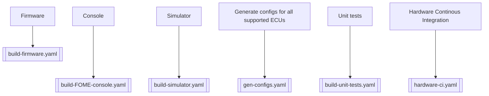

Here is a diagram of which configure scripts are used for which workflows.
This is not a complete diagram of all workflows, nor does it show everything that these jobs do.

For up-to-date information check the GitHib workflow actions (GHA) definition files *.yaml

The workflows are triggered by events: push & pull_request

