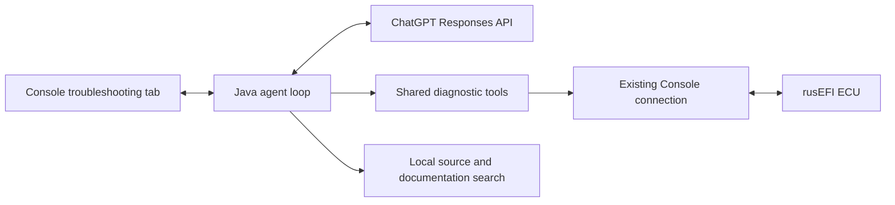

# Plan: integrated rusEFI troubleshooting assistant

Date: 2026-10-07

## Goal

Give users a downloadable ZIP that they can extract and launch to troubleshoot
rusEFI through the Console's ECU connection. ChatGPT authentication is working;
the next step is connecting model tool requests to local ECU diagnostics and
the downloaded source/documentation.

Include the wiki text and ship the ECU tool implementation with the client.
Packaging the MCP JAR alone does not provide the agent loop that connects these
pieces.

Implemented packaging step: `firmware/bin/zip_firmware_source.py` now includes
tracked wiki Markdown under `rusefi_documentation/`. The
`firmware-source-archive.yaml` GitHub Actions workflow builds and uploads this
source/documentation ZIP daily at 03:00 UTC and supports manual runs. Runnable
client packaging and the remaining integration below are still planned.

## Recommended architecture

## 1. Promote the sandbox into the delivered Console

Move authentication, credential storage, and chat logic out of the test source
set. Keep `LLMTabSandbox` as a development launcher, and add a production
troubleshooting tab.

Reuse the working authorization in `~/.rusefi/llm-access`. The user flow becomes:

1. Download and extract the ZIP.
2. Launch Console.
3. Connect to the ECU.
4. Sign in with ChatGPT.
5. Describe the problem.

## 2. Extract reusable tools from the MCP server

The repository already provides `:mcp_ecu:fatJar`, but `:mcp_ecu` currently
depends on `:ui`. Making `:ui` depend on it would create a dependency cycle.

Extract a shared `:ecu_tools` module containing tool definitions and diagnostic
handlers. Both the Console and standalone MCP server use it.

Inject the Console's existing `LinkManager`. The current MCP server opens its
own connection; running it beside a connected Console would compete for the
port. Closing the troubleshooting tab must release its subscriptions without
disconnecting the Console.

Include the shared tools in `rusefi_console.jar`. Keep the separate MCP
executable for external clients; the built-in assistant can invoke the same
handlers directly.

## 3. Implement the model/tool execution loop

The existing client streams text only. Extend it to:

- Advertise available tools and argument schemas.
- Collect complete function calls, validate arguments, and execute locally.
- Return each result with its `call_id`, then request the next response.
- Preserve complete response items, including returned reasoning items, in
  conversation history.
- Bound tool rounds, output sizes, and operation durations; support cancellation.

Keep `store=false` and `stream=true`. Follow the documented
[function-calling flow](https://developers.openai.com/api/docs/guides/function-calling),
[reasoning-history handling](https://developers.openai.com/api/docs/guides/reasoning),
and [ChatGPT plan inference requirements](https://developers.openai.com/siwc/token-sharing-open-source/models-and-inference).

## 4. Start with diagnostic capabilities

Reuse existing tools for ECU identity, tune reading, Lua reading, messages,
live channels, logging, and engine-sniffer capture.

Add tools that make troubleshooting efficient:

| Tool | Purpose |
| --- | --- |
| `diagnostic_snapshot` | Board, firmware signature, connection state, current faults and selected live values. |
| `list_output_channels` | Discover valid names, descriptions and units. |
| `read_live_values` | Read several channels together, reporting timestamps and freshness. |
| `read_tune_fields` | Return relevant calibration values without sending an entire tune. |
| `search_knowledge` / `read_knowledge` | Search documentation and source; retrieve bounded passages. |
| `export_diagnostic_case` | Save findings, tune, logs and captures for further support. |

Bind results to the current ECU session so reconnecting to another board cannot
silently reuse previous evidence.

For the first release, expose diagnostic operations. Add tune writes, arbitrary
commands and firmware updates later, with concrete proposed changes shown
before execution.

## 5. Expand the ZIP into a runnable troubleshooting distribution

Include Markdown from `../rusefi_documentation`. At the time of this review,
its 516 tracked Markdown files total 2.25 MiB uncompressed. Include selected
useful text attachments too; avoid sweeping in the multi-gigabyte PDF/image
collection.

Suggested contents:

| Content | Why |
| --- | --- |
| Console fat JAR and launchers | Runnable client. |
| Runtime/native dependencies | Clean-machine operation using existing bundle machinery. |
| Current firmware and libfirmware export | Implementation reference. |
| Wiki Markdown | Setup, wiring, troubleshooting and operational guidance. |
| Root `docs/AI/` and selected technical docs | Explain firmware behavior; currently absent from the source export. |
| Matching INI files | Interpret the connected firmware's channels and calibration. |
| Board connector/pin mappings and Lua examples | Board-specific diagnosis and practical examples. |
| Manifest, document index and licenses | Version identification, retrieval and attribution. |

Reuse the normal Console bundle assembly rather than duplicating its dependency
selection inside `firmware/bin/zip_firmware_source.py`. CI should combine that
runtime with the exporter's content into the ZIP users download. Users should
not need Git, Python or Gradle.

Record firmware, libfirmware, wiki and client revisions, plus payload hashes
and whether exported sources contain local changes. A source snapshot must not
be presented as matching the ECU unless its version is verified.

## 6. Make local knowledge usable by the model

Unzipping source does not automatically give ChatGPT access to it. Implement
local search over the supplied files, initially using keyword and exact-symbol
search.

Return relevant passages with file paths, line numbers and version information.
Keep reads inside the selected knowledge directory, including protection
against symlinks escaping it. Send retrieved passages and diagnostic results
as needed; credentials stay outside this searchable content.

Preserve references to omitted diagrams so the assistant can point users to
the original documentation when text is insufficient.

## 7. Validate the complete user journey

Test from a clean machine with the delivered ZIP:

- Launch and restore authorization.
- Connect and resolve the correct INI.
- Collect evidence and answer with citations.
- Cancel operations and handle unplug/reconnect.
- Export a diagnostic case.

A useful first acceptance scenario is: "The engine cranks but won't start."
The assistant should collect firmware identity, relevant tune values, cranking
voltage/RPM, synchronization evidence and messages, then explain supported
findings and the next measurement needed.

## First implementation milestone

Complete one working local tool call through the existing Console connection,
followed by source/wiki search. This proves the essential integration before
expanding packaging and the tool catalog.
