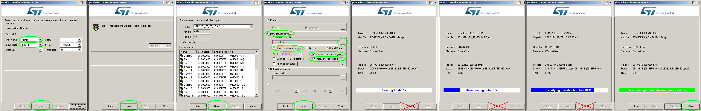

# Bootloader

*** User Manual ***

To start the bootloader updater:
- Turn off your rusEFI ECU board, and connect UART to PC.
- Download "FLASHER-STM32" here: http://www.st.com/en/development-tools/flasher-stm32.html
- Run "STMFlashLoader Demo", set COM-port parameters (the same as in TunerStudio).
- Press the "Next" button.
- Turn on the ECU board.
- If the connection is successful, the next page of STMFlashLoader appears immediately. Press "Next" button again and follow the instructions.
- You can use:
  - Upload from device (Flash Read) command;
  - Download to device (Flash Write) command;
  - Erase->Selection command (only Sector erase is currently supported, not Full Erase!).

To update the firmware:
- choose "Download to device" mode;
- select the firmware file (rusefi.hex). Note! ***Use only recent firmware builds with bootloader support!***
- you may select "verify" option to check 
- you may select "Jump to the user program" to automatically run the main firmware after the update.

!!! Note that the bootloader can update only the main firmware, but not itself !!!

Use this code on your own risk!

*** Developers Section ***

How it works, in two words:
- The bootloader requires a separate makefile because it's a separate binary executable with its own project settings and fileset.
- Start firmware/bootloader/compile_bootloader.bat to compile the bootloader code. Use it only if bootloader modification is required.
- The compiled bootloader code is stored in bootloader/bootloader_generated.hxx and it can be included into the main firmware (build/rusefi.hex) if the bootloader support is enabled.
- The bootloader support is disabled by default (USE_BOOTLOADER=no). You can enable it by adding "USE_BOOTLOADER=yes" to Makefile or "SET USE_BOOTLOADER=yes" to your Windows compile batch-file.
- When USE_BOOTLOADER=yes, a special version of linker script is used: STM32F407xG_CCM_bootloader.ld. It shifts 'flash' memory address to 32kb (0x08008000), and clears a space for bootloader at the very beginning of the flash memory. It also adds section ".bl" for the bootloader code.
- The file bootloader_storage.c used to include the bootloader code into the firmware (using '.bl' section).
- In result, there are two binary executables combined in one firmware: the bootloader starts first, and the main firmware start afterwards.
- All those can be overridden by board configs and makefiles - that's exactly how it's been compiled for Prometheus board.

The bootloader executable works as follows:
- Init ChibiOS and UART/Serial driver using tunerstudio_io code;
- Create a thread to listen to UART (thBootloaderSerial), using dfuStartLoop();
- The PC 'stm32-flasher' software sends its request byte only once, so we don't wait for it - the bootloader sends an answer as soon as it starts (both the request & answer bytes are known consts);
- If the next command doesn't come immediately (<100 ms), we abort the bootloader dfu loop and run the application code - calling dfuJumpToApp() in main().
- Otherwise, if at least one command is received, we stay in the bootloader mode and process commands.
