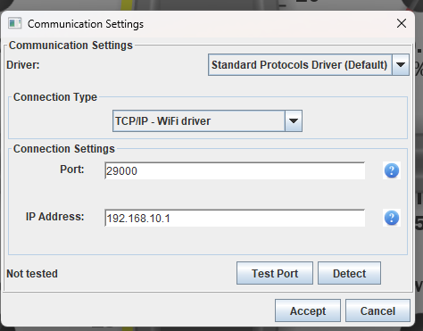

NUCLEO-F767ZI features STM32F767ZI with 2MB Flash.

Ethernet available at 192.168.10.1, port 29000

you need to set static IP on you laptop ethernet interface.

Network, right click - settings. Then find ethernet connection and open statistic window by left clicking on "Ethernet'.

Go to Properties. Select "Internet Protocol Version 4 (TCP/IPv4)", press Settings.

Select "Use the following IP address"

Enter

IP address: 192.168.10.9

Subnet mask: 255.255.255.0

Default gateway: 192.168.10.1

Preferred DNS server: 8.8.8.8 (don't care).
