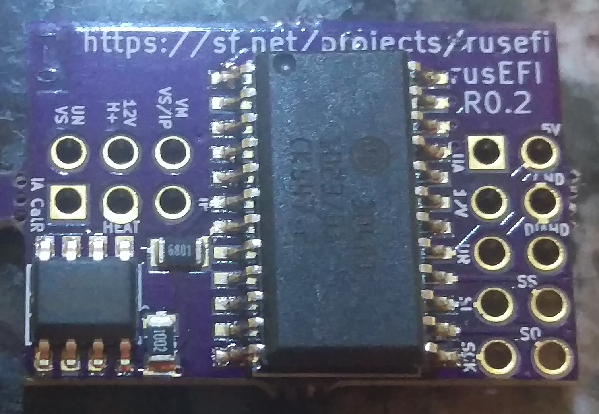

[iBom](https://rusefi.com/docs/ibom/O2_input_CJ125_latest.html)

2019 status: known to work, but documentation is very limited :(

On this board UR and UA do NOT have build-in resistor dividers.

There is an opinion that for open air UA divider is required.