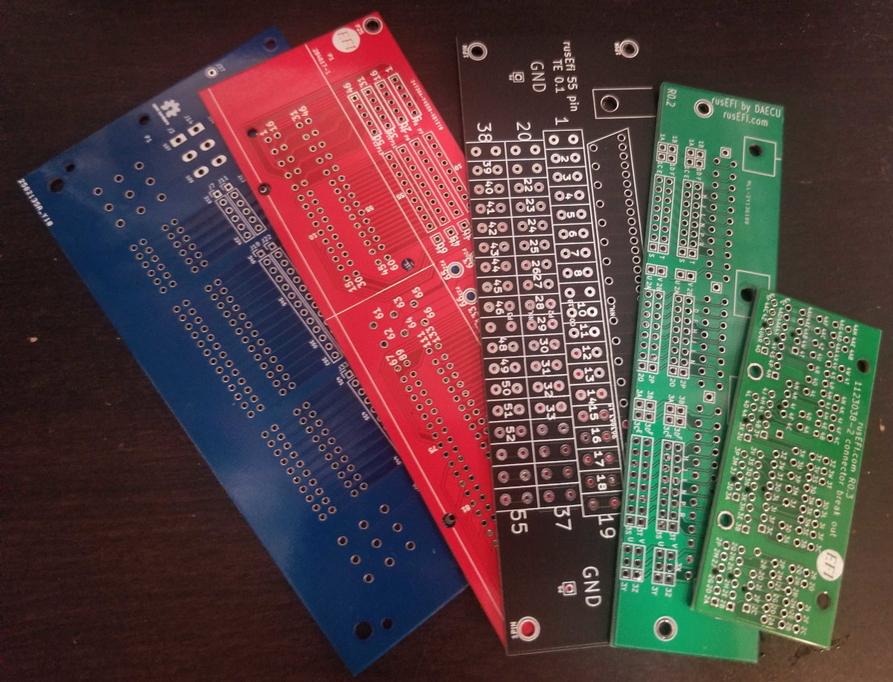

# Connectors
Some vehicle-specific connector boards are also pretty nice if you want to keep original harness intact

See [Connectors wiki page](http://rusefi.com/wiki/index.php?title=Hardware:OEM_connectors)
todo: move Connectors wiki page content into git

* [35 pin](Breakout_35pin_MX7-C-35PL-C11-connector) Mazda TCU
* [38 pin](Breakout_38pin_NGC-connector) Chrysler NGC connector
* [48 pin](Breakout_48pin_174917-Connector) Mazda Miata NA6
* [52 pin](Breakout_52pin_172319-1-Connector) Mitsubishi Galant VR4
* [55 pin](Breakout_55pin_963063-15-Connector) TE Lada
* [55 pin](breakout_55pin-motronic-Connector) Motronic 1.5.x BMW/GM
* [60 pin](Breakout_60pin_EEC-IV-Connector) Ford EEC-IV
* [64 pin](Breakout_64pin_176122-6-Connector) Mazda Miata NA NB1, Honda Civic
* [68 pin](Breakout_68pin_966595-1_and_963356-1-Connector) Volkswagen Audi VAG
* [72 pin](Breakout_72pin_1123038-2-Connector) Mazda Miata NB2
* [88 pin](Breakout_88pin_VAG-Connector) Volkswagen Audi VAG
* [121 pin](Breakout_121pin_368255-2-Connector) Volkswagen Audi VAG
* [134 pin](Breakout_134pin_7-967288-1-Connector) BWM
* [154 pin](Breakout_154pin_284617-1-Connector) Volkswagen Audi VAG

# Modules
* [stm32 Brain board 48pin](mini48-stm32)
* [stm32 Brain board 100pin](brain_board)
* [stm32 Brain board 176pin](brain_board_176-pin)
* [CAN module](can_board) CAN using SN65HVD230
* [VR module](VR_Board) Variable Reluctance conditioner board VR MAX9926
* [Wideband module](CJ125_board) CJ125 Bosch Wideband board
* [VND5E025AKTR](PowerSSO-24_breakout) double channel high-side driver with analog current sense (used on Dodge Neon 2003 test mule)
* [BTS21400](DDPAK_breakout) ignition coil IGBT driver (used on Dodge Neon 2003 test mule)
* [TLE6240 module](low_side_tle6240) integrated low side switch (fabricated, not tested)
* [TLE6244 module](Breakout_TLE6244) integrated low side switch (never actually fabricated)
* [TLE8810ED module](TLE8110ED_breakout_board) integrated low side switch (fabricated, not tested)
* [MC33816](Common_Rail_MC33816) common rail driver (never actually fabricated)
* [LM1949](Low-Z_LM1949) low impedance injector driver (never actually fabricated)

New modules are being added to https://github.com/rusefi/hw_modular

Some stuff we have given up on completely is located at https://github.com/rusefi/hw_legacy

Above mentioned modules are known to work unless stated otherwise

### More rusEFI hardware

See https://github.com/rusefi/rusefi/wiki/Hardware

# Frankenso
Frankenso has moved to https://github.com/rusefi/rusefi-hardware/tree/main/classic-designs

# More info

 [Interactive Html Boms](https://rusefi.com/docs/ibom/)

See [Hardware status forum thread](http://rusefi.com/forum/viewtopic.php?f=4&t=260)
todo: move hardware status content into git

# Important note
rusEFI is currently transitioning from KiCAD 4 to KiCAD 5.

# Important note

Depends on libraries from https://github.com/rusefi/kicad-libraries

If you download complete repo do not forget to download libraries. If you git clone be sure to also

`git submodule update --init`

`git submodule update --init`

